# Visual check

Проверен внешний вид игры на тестовом сервере. Мерило: дизайн-система проекта, разделы Брифа «Макет» и «Дизайн» и макет «Табло».

## Что проверено

Экраны:

- главная до входа и окно входа;
- вкладка Hero: итог отсутствия, ежедневный сундук, лента, «Near you», снаряжение, настройка «скрыть имя»;
- вкладка Chests: сундук ждёт, открытие с лентой предметов, квитанция запечатана, квитанция готова к проверке, квитанция со штампом «Verified»;
- вкладка Season: таблица очков и таблица приглашений;
- вкладка Friends;
- экран приза: баннер на Hero и форма подтверждения после конца сезона;
- экраны для чтения: честность, правила, шансы, призы, победители;
- служебная страница команды, один снимок.

Ширина экрана: телефон 390, узкий телефон 320, компьютер 1280. Один раз проверено уменьшенное движение. Проверены пустые списки и серые строки-заглушки при загрузке. На каждом экране измерены нажимаемые элементы и прокрутка вбок.

Общее впечатление хорошее. Тёмный тёплый стол, розовые только действия, кремовая квитанция, числа моноширинным шрифтом. Полоса сезона закреплена, на 320 подпись «pts» убирается, числа не переносятся. Квитанция запечатана до 00:00 UTC, штамп появляется только после проверки. При уменьшенном движении итог сундука виден сразу.

## Что исправлено

1. Экраны для чтения на компьютере. Полоса сезона растягивалась на всю ширину, шапки с вкладками не было. Теперь у правил, шансов, честности, квитанции, приза и победителей та же шапка, что у вкладок.
   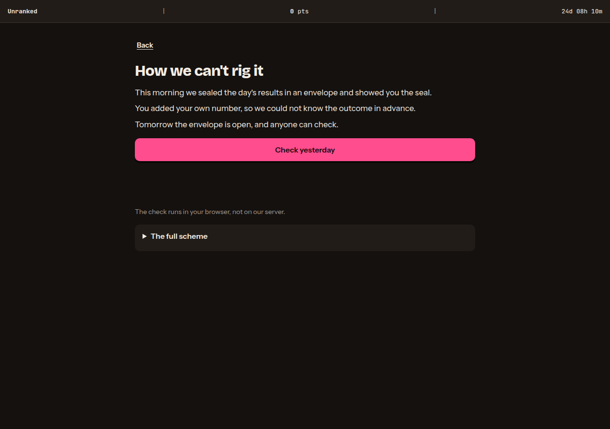 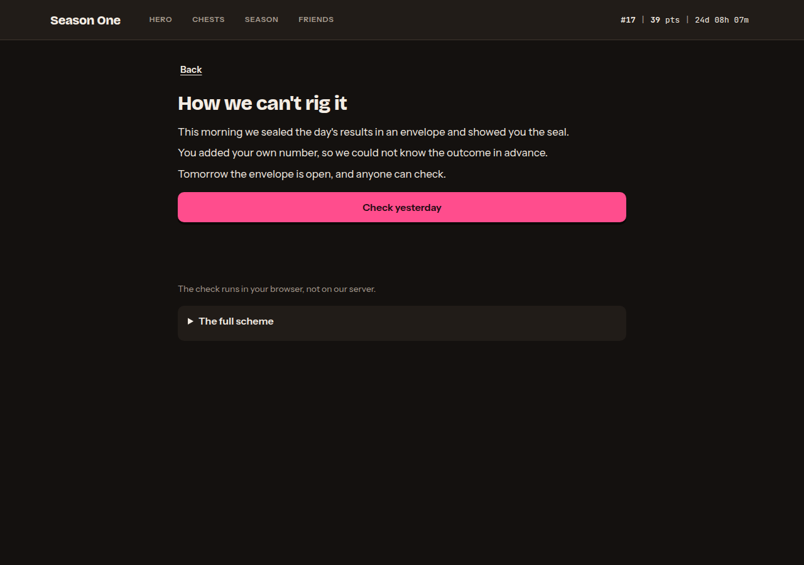
2. Экран честности. Под кнопкой «Check yesterday» была пустая дыра. Теперь пояснение стоит сразу под кнопкой.
   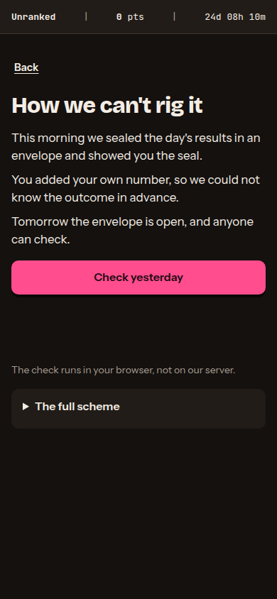 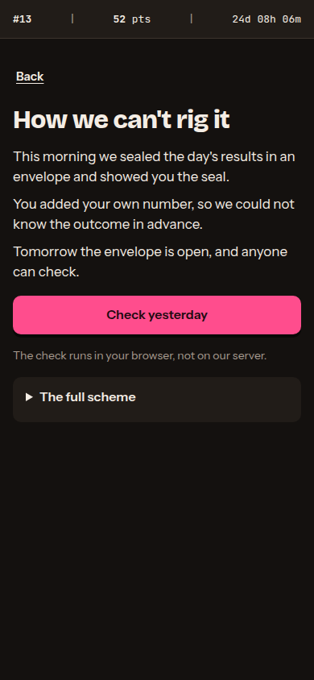
3. Переключатель «Points / Invites». Он выглядел как вторая большая розовая кнопка и спорил с таблицей. Дизайн-система разрешает одну главную кнопку на экран. Теперь это спокойный переключатель, выбранная сторона отмечена розовой чертой, как вкладка.
   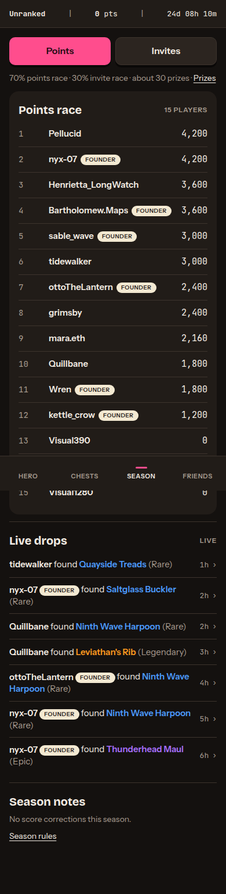 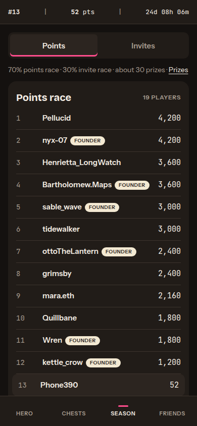
4. Кнопка «Start playing» на телефоне была уже колонки. Теперь она во всю ширину, как требует дизайн-система.
   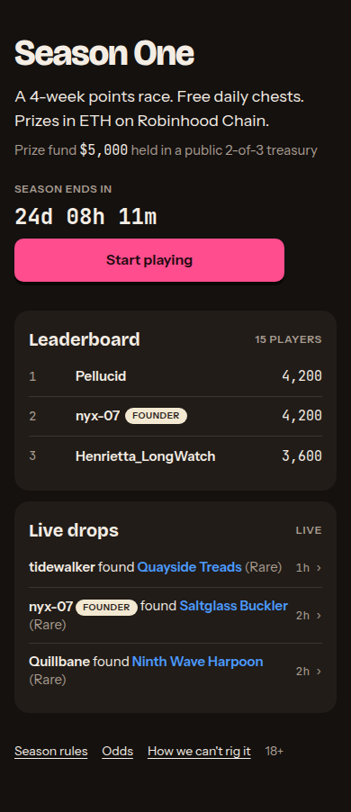 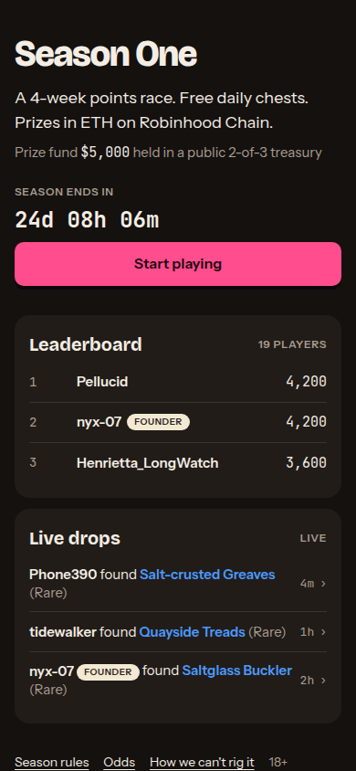
5. Ссылки внизу экранов, ссылка «Prizes» и раскрытие подробной схемы были высотой 18–32 пикселя. Теперь все не меньше 44, пальцем не промахнуться.
   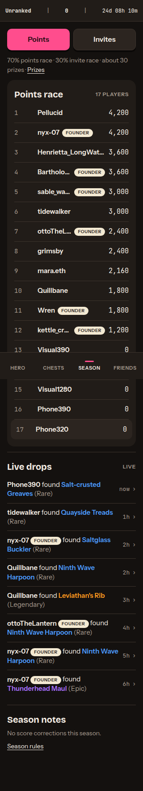 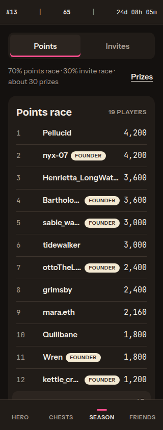
6. Подчёркнутые ссылки «Back», «Full table» стояли на 4 пикселя правее края колонки. Теперь ровно по краю.
7. Ссылка-приглашение на узком экране обрезалась посреди знака. Теперь она заканчивается многоточием, кнопка копирует полную ссылку.
   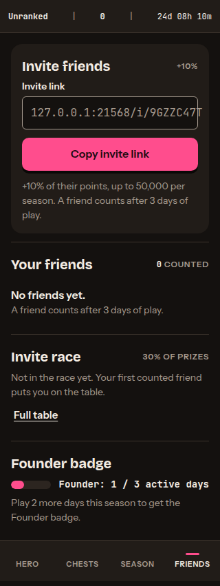 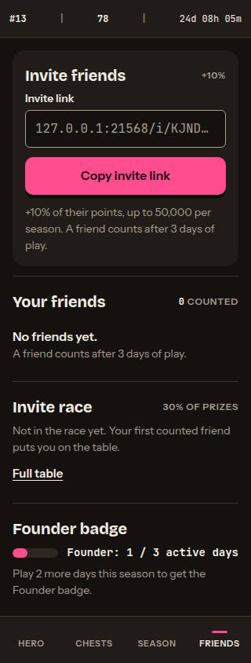
8. Строка самого игрока в таблице была сдвинута относительно других строк. Теперь место и имя стоят в тех же столбцах.
   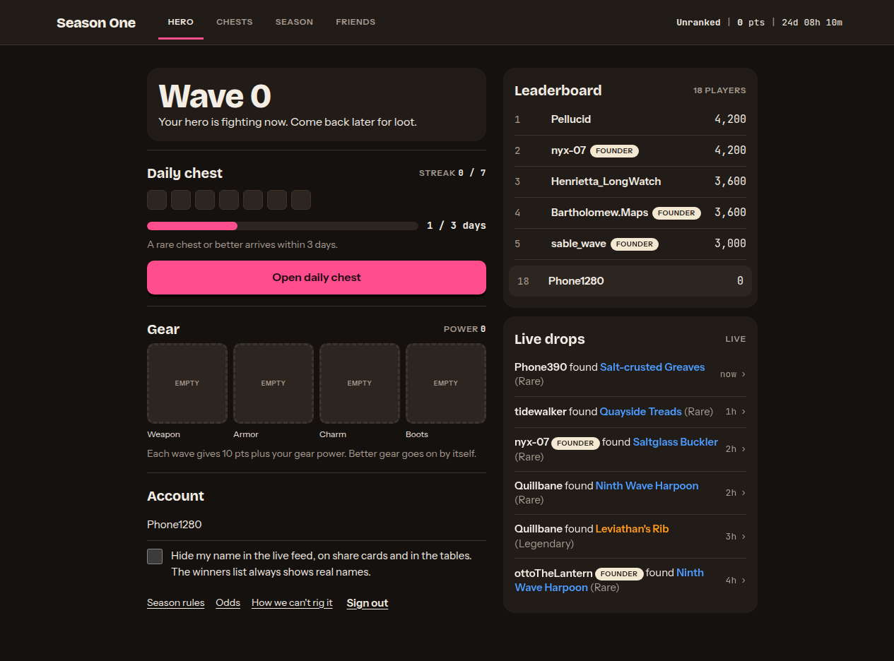 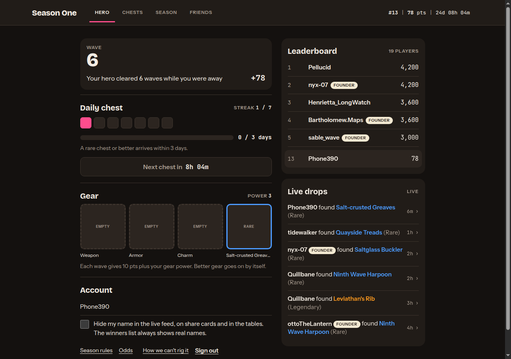
9. Подписи «1 players», «1 inviters». Теперь «1 player», «1 inviter», «1 more counted friend».
   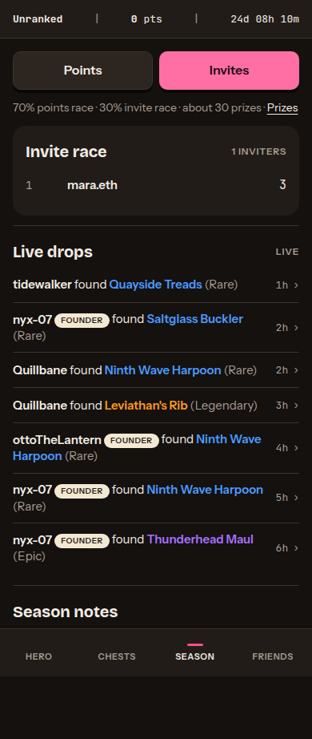 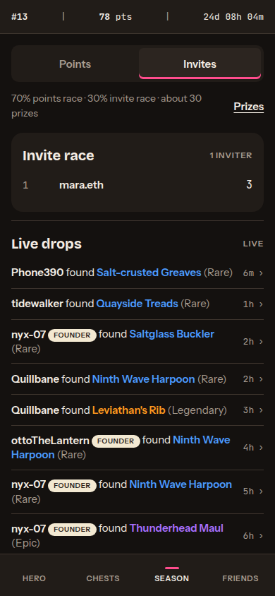
10. Даты в сентябре выходили как «29 Sept», рядом с «02 Oct». Теперь везде «29 Sep», в том числе на карточке для соцсетей. На это есть тест.
11. Бриф просит на экранах для чтения показывать местное время рядом с UTC. Теперь правила показывают конец сезона и в местном времени игрока, экран приза — срок подтверждения.
    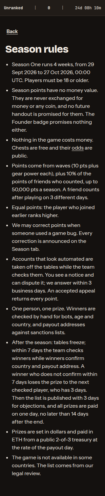 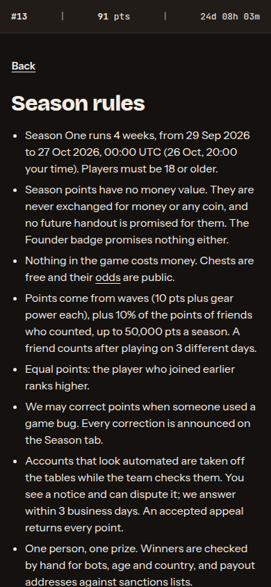
12. Адрес выплаты не помещался в поле на телефоне, конец адреса был не виден. Сверять адрес нужно как раз по первым и последним знакам. Теперь адрес помещается целиком на ширине 390.
    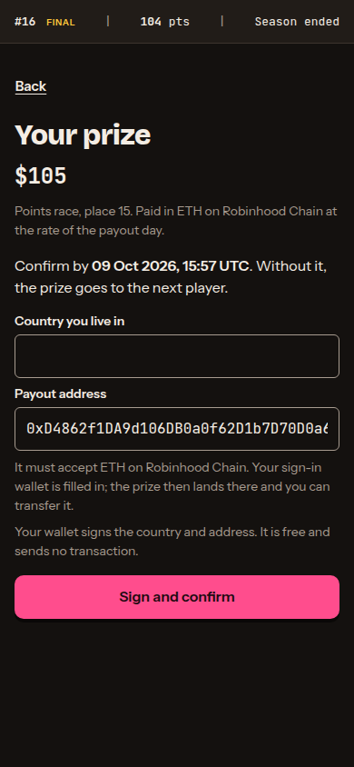 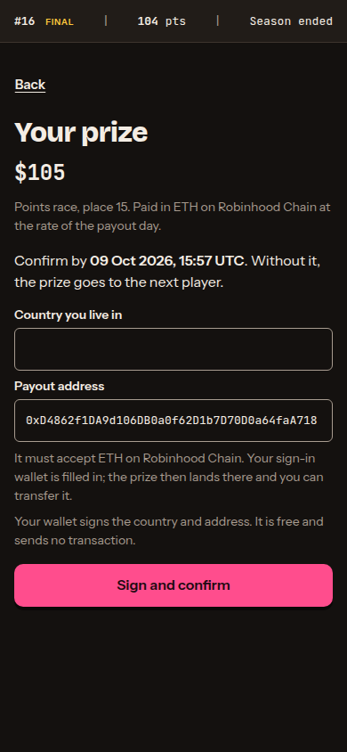
13. После захода очки в полосе сезона и в своей строке таблицы до 15 секунд расходились. Теперь таблица загружается после начисления волн, числа совпадают сразу.

## Как выглядит сейчас

- Главная: [компьютер](visual/landing-1280.png), [узкий телефон](visual/landing-320.png), [загрузка](visual/loading-390.png).
- Вход: [телефон](visual/signin-390.png), [компьютер](visual/signin-1280.png).
- Hero: [телефон](visual/hero-390.png), [компьютер](visual/hero-1280.png), [скрыть имя](visual/hide-name-390.png).
- Сундук: [ждёт](visual/chests-closed-390.png), [открытие](visual/chest-opening-390.png), [запечатана](visual/receipt-sealed-390.png), [готова к проверке](visual/receipt-ready-390.png), [проверена](visual/receipt-verified-390.png), [уменьшенное движение](visual/reduced-motion-390.png).
- Season: [компьютер](visual/season-1280.png).
- Friends, пустой список: [телефон](visual/friends-empty-390.png).
- Чтение: [шансы](visual/odds-390.png), [честность](visual/fair-1280.png).
- Приз: [баннер](visual/prize-banner-390.png), [экран приза](visual/prize-1280.png).
- Служебная страница: [компьютер](visual/admin-1280.png).

## Что осталось и почему

1. Место в таблице и место приза могут различаться. Пример: в полосе «#16 final», на экране приза «place 15». Оба числа верны. Игрок выше взял больший приз в гонке приглашений, его место в гонке очков ушло следующему. Игрока это может смутить. Нужна одна поясняющая строка, вопрос ниже.
2. Служебная страница команды. Подсказки внутри полей служат единственной подписью и обрезаются. Страницей пользуется только команда, игроки её не видят. Исправить вместе со следующими работами над страницей.
3. Строка «Founder: 1 / 3 active days» на телефоне сжимает полоску прогресса. Текст задан Брифом. Мелочь, оставлена.
4. Пока идёт загрузка, отсчёт на главной пуст, над кнопкой пустое место. Длится доли секунды. Мелочь, оставлена.
5. На компьютере нижняя половина главной пустая. Содержимое главной задано Брифом, добавлять нечего.
6. Вместо картинок предметов — подписанные пустые рамки. Так решено до покупки набора иллюстраций.
7. Не сняты: лист перевода приза, уведомление о проверке аккаунта, опубликованный список победителей, режим без сети. Их нет в списке этого этапа. Для перевода нужен выплаченный приз.
8. Внешний вид страниц автоматически не проверяется. Тестом закрыт только формат дат. Для остального нужен браузер в тестах, его в проекте пока нет.

На снимках тестовые игроки и тестовые данные. Для снимка экрана приза тестовый сезон был завершён досрочно, потом база вернулась к идущему сезону.
